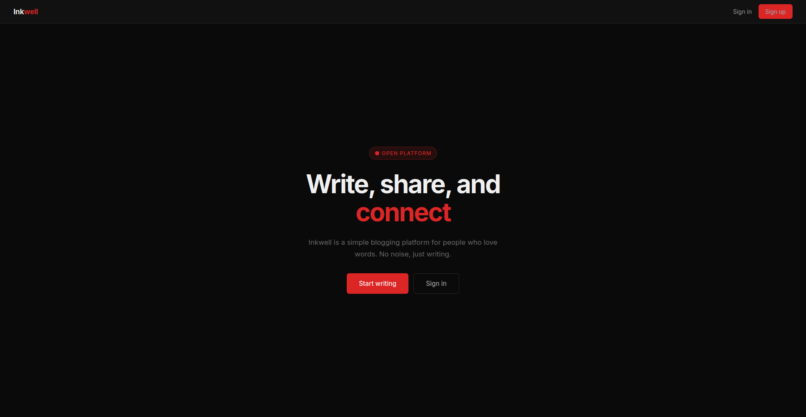

# Inkwell

A minimal blogging platform for people who love words. No noise, just writing.



---

## Features

- User registration and authentication (sign up, sign in, sign out)
- Create, edit, and delete blog posts
- Markdown support in post content (code blocks, tables, line breaks)
- Draft / published toggle per post
- Tag system with auto-generated slugs
- Comments on posts
- Each user sees only their own posts on the dashboard
- Django admin panel for content management
- Static files served via Nginx (not Django)

---

## Tech Stack

| Layer | Technology |
|-------|-----------|
| Backend | Django 6.0.1 + Gunicorn |
| Database | PostgreSQL 16 |
| Reverse Proxy | Nginx 1.27 |
| Containerisation | Docker + Docker Compose |
| CI/CD | GitHub Actions |
| Image Registry | Docker Hub |
| Hosting | Hetzner VPS |
| SSL | Let's Encrypt (Certbot) |
| Testing | pytest + pytest-django |
| Linting | flake8 |

---

## Project Structure

```
.
├── blog/                   # Main app (models, views, urls, tests)
├── blog_project/           # Django project settings and wsgi
│   ├── settings.py
│   └── settings_test.py    # SQLite override for CI tests
├── user/                   # Auth app (register, login, logout)
├── templates/              # HTML templates
├── nginx/
│   └── nginx.conf          # Nginx config for the app container
├── docs/                   # Technical documentation
├── scrnshots/              # Screenshots
├── Dockerfile              # Multi-stage production image
├── docker-compose.yml      # Local development
├── docker-compose.prod.yml # Production (VPS)
├── entrypoint.sh           # Runs migrations + collectstatic on startup
├── pytest.ini              # pytest configuration
└── requirements.txt
```

---

## Local Setup

### Prerequisites

- Docker
- Docker Compose

### Steps

**1. Clone the repository**
```bash
git clone https://github.com/oblivion-hq/inkwell.git
cd inkwell
```

**2. Create the `.env` file**

Create a `.env` file in the project root (see Environment Variables section below).

**3. Start all services**
```bash
docker compose up -d --build
```

This starts three containers:
- `blog_postgres` — PostgreSQL database
- `blog_django` — Django app (runs migrations and collectstatic automatically)
- `blog_nginx` — Nginx serving on port 80

**4. Create a superuser (admin)**
```bash
docker exec -it blog_django python manage.py createsuperuser
```

**5. Open the app**

- App: http://localhost/
- Admin panel: http://localhost/admin/

### Useful Commands

```bash
# View logs
docker compose logs -f web

# Stop everything
docker compose down

# Stop and wipe the database
docker compose down -v

# Run tests
pytest --tb=short -v
```

---

## Environment Variables

Create a `.env` file in the project root with the following variables:

| Variable | Description | Example |
|----------|-------------|---------|
| `SECRET_KEY` | Django secret key — keep this random and private | `p%%98r0w*bi%av721...` |
| `DEBUG` | Enable Django debug mode | `True` (dev) / `False` (prod) |
| `ALLOWED_HOSTS` | Comma-separated list of allowed hostnames | `localhost,127.0.0.1` |
| `DB_ENGINE` | Django database backend | `django.db.backends.postgresql` |
| `DB_NAME` | Database name | `blog_db` |
| `DB_USER` | Database user | `bloguser` |
| `DB_PASSWORD` | Database password | `strongpassword` |
| `DB_HOST` | Database host (service name in Docker) | `db` |
| `DB_PORT` | Database port | `5432` |
| `CSRF_TRUSTED_ORIGINS` | Trusted origins for CSRF (required for HTTPS) | `https://yourdomain.nip.io` |
| `DOCKERHUB_USERNAME` | Docker Hub username (prod only, used in compose) | `yourdockeruser` |

### Example `.env` for local development

```env
SECRET_KEY=any-random-string-for-local-dev
DEBUG=True
ALLOWED_HOSTS=localhost,127.0.0.1

DB_ENGINE=django.db.backends.postgresql
DB_NAME=blog_db
DB_USER=bloguser
DB_PASSWORD=blogpass123
DB_HOST=db
DB_PORT=5432

CSRF_TRUSTED_ORIGINS=http://localhost
```

---

## Running Tests

Tests use SQLite in-memory so no database server is needed:

```bash
pytest --tb=short -v
```

The test settings are in `blog_project/settings_test.py` and `pytest.ini` points to them automatically.

---

## Deployment

The app is deployed to a Hetzner VPS using GitHub Actions. Every push to `main` triggers the full pipeline:

```
push to main → lint + test → build Docker image → push to Docker Hub → SSH deploy to VPS
```

### GitHub Secrets Required

Set these in **GitHub → Settings → Secrets and variables → Actions**:

| Secret | Value |
|--------|-------|
| `DOCKERHUB_USERNAME` | Your Docker Hub username |
| `DOCKERHUB_TOKEN` | Docker Hub access token (Read/Write) |
| `SSH_HOST` | VPS IP address |
| `SSH_USER` | SSH username on the VPS |
| `SSH_PRIVATE_KEY` | Private key of user that ssh ins |
| `SSH_PORT` | SSH port (usually `22`) |

### Manual First-Time Server Setup

```bash
# 1. Create the Docker network
docker network create proxy_network

# 2. Create the deploy directory and .env
mkdir -p ~/inkwell
nano ~/inkwell/.env   # fill in production values

# 3. First deploy — push to main and let CI/CD handle it
#    or run manually:
cd ~/inkwell
docker compose -f docker-compose.prod.yml pull
docker compose -f docker-compose.prod.yml up -d

# 4. Create admin user
docker exec -it blog_django python manage.py createsuperuser
```

For full SSL setup instructions see [docs/SSL_CERTIFICATE.md](docs/SSL_CERTIFICATE.md).
For CI/CD pipeline details see [docs/CICD_Pipeline.md](docs/CICD_Pipeline.md).

---

## Documentation

| File | Description |
|------|-------------|
| [docs/Docs-Dockerfile.md](docs/Docs-Dockerfile.md) | Dockerfile and entrypoint explained |
| [docs/docker-compose-dev.md](docs/docker-compose-dev.md) | Local Docker Compose explained |
| [docs/docker-compose-prod.md](docs/docker-compose-prod.md) | Production Docker Compose explained |
| [docs/CICD_Pipeline.md](docs/CICD_Pipeline.md) | GitHub Actions pipeline explained |
| [docs/SSL_CERTIFICATE.md](docs/SSL_CERTIFICATE.md) | SSL setup with Let's Encrypt |
