# Technical Report — Inkwell

**Student:**  **ID:** 00015589 | **Word count:** ~1100

---

## Application Overview

Inkwell is a minimal blogging platform built with Django 6. Users can register, write posts in Markdown, apply tags, leave comments, and toggle draft or published status per post. A public REST API exposes all published posts as JSON, allowing third-party sites to consume the content programmatically.

**Technologies:** Django 6 + Gunicorn (backend), PostgreSQL 16 (database), Nginx 1.27 (reverse proxy and static files), Docker + Docker Compose (containerisation), GitHub Actions (CI/CD), Docker Hub (image registry), Hetzner VPS (hosting), Let's Encrypt (SSL), pytest (testing).

**Database schema — four models:**

| Model   | Key Fields                                              | Relationships                          |
|---------|---------------------------------------------------------|----------------------------------------|
| User    | username, password, date_joined                         | Built-in Django model                  |
| Tag     | name (unique), slug (auto-generated)                    | Many-to-Many ↔ Post                    |
| Post    | title, slug, content, excerpt, published, created_at    | FK → User (CASCADE); M2M ↔ Tag        |
| Comment | body, approved, created_at                              | FK → Post (CASCADE); FK → User (SET_NULL) |

Post has a many-to-one relationship with User (each post belongs to one author) and a many-to-many relationship with Tag (a post can have multiple tags; a tag can belong to multiple posts). Comment uses SET_NULL on the User foreign key so comments survive if the author account is deleted.

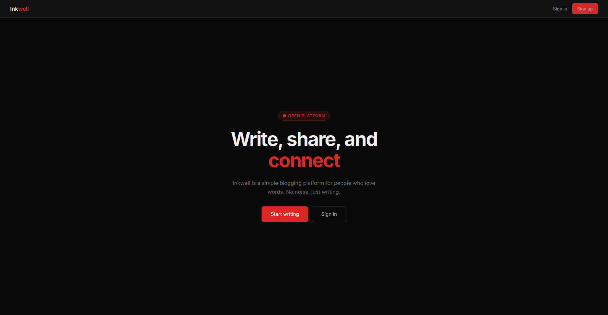

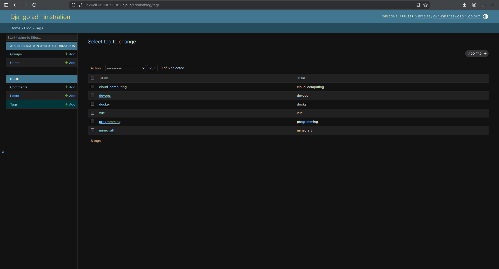

---

## Containerization Strategy

The Dockerfile uses a **multi-stage build** to produce a lean, production-ready image. **Stage 1 (builder)** installs gcc and libpq-dev, creates a Python virtual environment, and pip-installs all dependencies into it. **Stage 2 (runtime)** starts from a fresh `python:3.12-slim` base, copies only the completed virtual environment from the builder, and copies the application code. Build tools never reach the final image, reducing its attack surface.

A non-root user (`appuser`, UID 1001) owns and runs the application — following the principle of least privilege. If the container is compromised, the attacker does not gain root on the host.

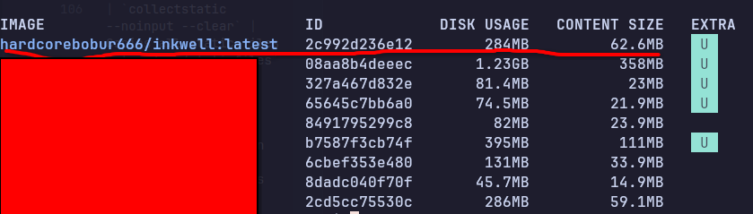

Two Compose files serve different purposes:

- `docker-compose.yml` **(development):** builds locally (`build: .`), binds port 80 directly, uses hardcoded dev credentials.
- `docker-compose.prod.yml` **(production):** pulls the pre-built image from Docker Hub (`image: user/inkwell:latest`), uses `expose: 80` instead of `ports`, and joins an external `proxy_network` so the shared reverse proxy can route to it.

Three services: `db` (PostgreSQL 16), `web` (Django + Gunicorn, 3 workers, 120s timeout), `nginx` (serves static files and proxies requests to Gunicorn). The `web` service uses `depends_on: db: condition: service_healthy` so Django never starts before the database is ready.

All secrets are stored in a `.env` file on the server, never committed to the repository. The `env_file: .env` directive injects them into the container at runtime. The `.dockerignore` excludes `.env`, `venv/`, `__pycache__/`, and `staticfiles/` from the build context.

**Volumes:** `postgres_data` persists the database across deploys. `static_volume` is shared between `web` (Django writes via `collectstatic`) and `nginx` (mounted read-only).

---

## Deployment Configuration

The application runs on a **Hetzner VPS** (Ubuntu). A dedicated `deploy` user was created and added to the `docker` group, so the CI/CD pipeline can operate containers via SSH without requiring root or sudo.

**Firewall:** UFW was configured to allow only ports 22 (SSH), 80 (HTTP), and 443 (HTTPS). All other inbound connections are denied by default.

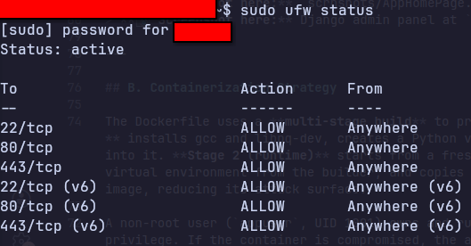

**Nginx + Gunicorn:** Gunicorn binds to `0.0.0.0:8000` inside the container with 3 worker processes. The app-level Nginx container proxies all requests to Gunicorn, forwards `X-Forwarded-Proto` and `X-Real-IP` headers, and serves static files directly from the shared volume — bypassing Django completely.

**SSL:** Let's Encrypt certificates were issued with Certbot in standalone mode (`certbot certonly --standalone`). The shared proxy was stopped briefly for the ACME HTTP-01 challenge, then restarted with the certificates mounted and HTTPS configured. HTTP traffic on port 80 redirects to HTTPS with a 301 redirect.

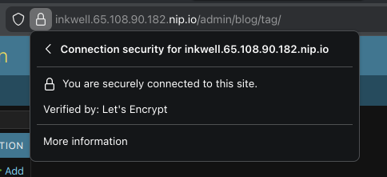

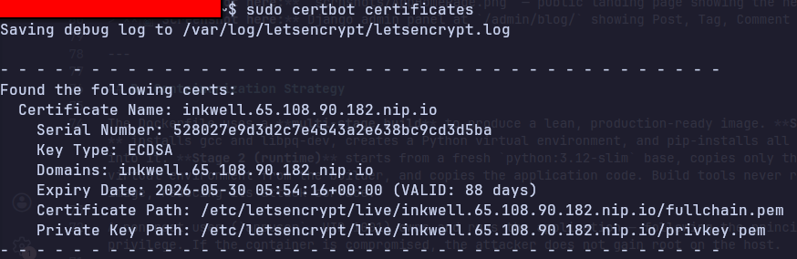

**Domain:** The domain `inkwell.[IP].nip.io` uses nip.io's wildcard DNS — it resolves any subdomain to the embedded IP. No DNS registration was required.

**Security measures summary:** secret key and database credentials from environment variables; non-root container user; UFW firewall; SSH key authentication only (no passwords); `SECURE_PROXY_SSL_HEADER` set in Django so CSRF validation works correctly behind the HTTPS proxy; `CSRF_TRUSTED_ORIGINS` configured to match the live domain.

---

## CI/CD Pipeline

Every push to `main` triggers a full three-job pipeline. Pull requests to `main` trigger **only the test job** — the build and deploy jobs carry the condition `if: github.ref == 'refs/heads/main' && github.event_name == 'push'`, so reviewers can verify tests pass before any code ships.

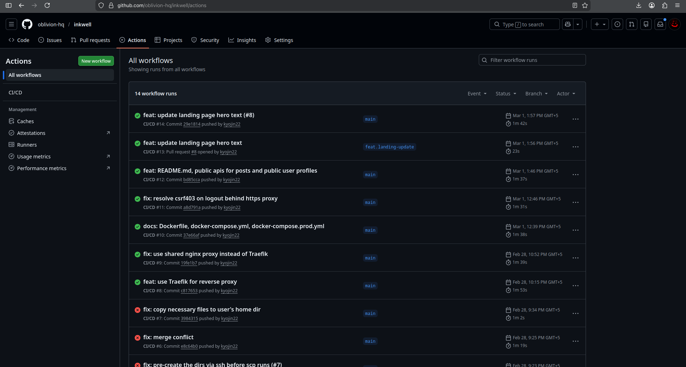

**Job 1 — Lint & Test:** Checks out the code, installs Python 3.12 with pip caching, runs `flake8` across all app directories, then executes `pytest`. Tests run against an in-memory SQLite database — no PostgreSQL needed in CI. Eight tests cover model slug generation, markdown rendering, view authentication redirects, CRUD operations, and post ownership isolation between users.

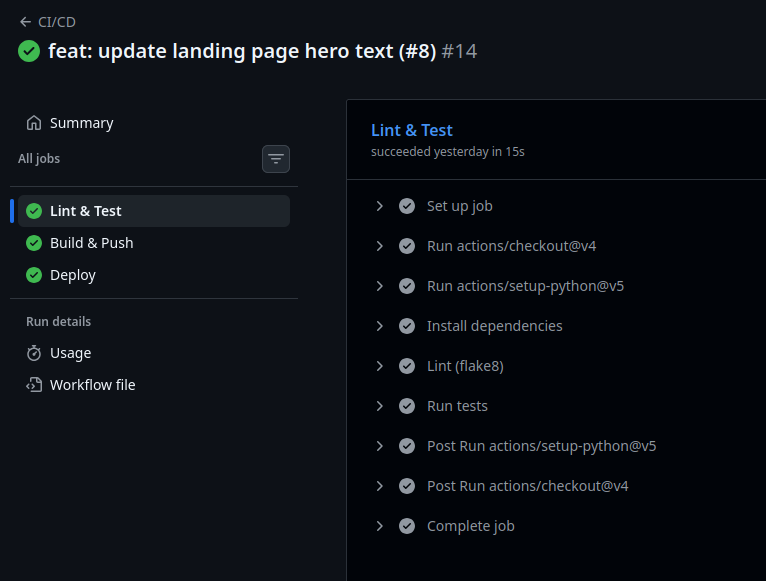

**Job 2 — Build & Push:** Logs into Docker Hub using repository secrets, then uses `docker/build-push-action` to build and push the image with two tags: `:latest` and `:<commit-SHA>`. The SHA tag makes every build uniquely traceable to its source commit.

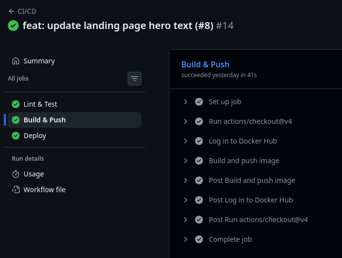

**Job 3 — Deploy:** SSHs into the VPS as the `deploy` user using the stored private key. Copies the updated `docker-compose.prod.yml` and `nginx/nginx.conf` to the server via SCP, then runs `docker compose pull` followed by `docker compose up -d --remove-orphans`. The `entrypoint.sh` inside the new container automatically runs `migrate` and `collectstatic` before Gunicorn starts — zero manual steps required.

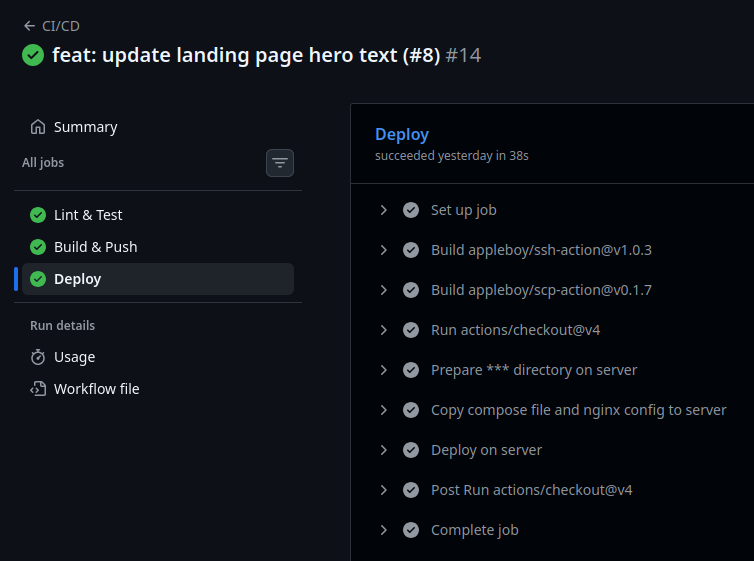

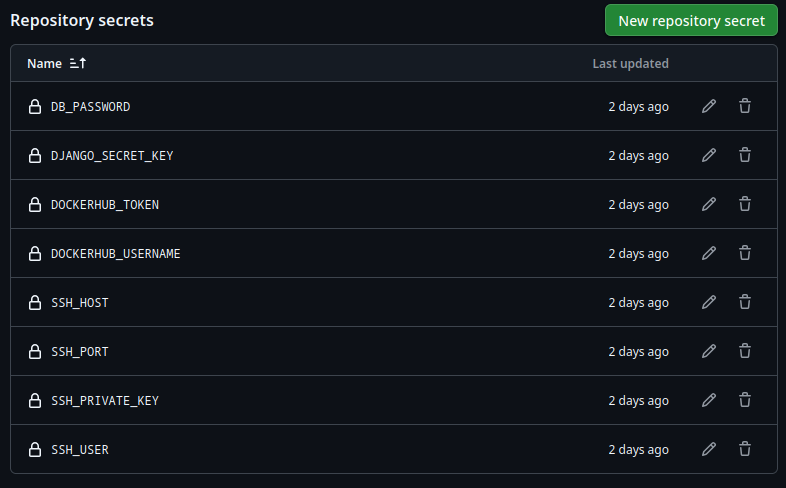

---

## Challenges and Solutions

**Challenge 1 — Port conflict on the VPS.** The server already ran other projects on port 80. Binding Inkwell's nginx directly to port 80 caused a startup failure. *Solution:* deployed a single shared nginx reverse proxy container that owns ports 80 and 443. Each project's nginx only uses `expose: 80` (container-internal) and joins the shared `proxy_network`. The proxy routes requests by subdomain using separate config files — adding a new project requires only a new config file, not a port change.

**Challenge 2 — CSRF 403 on logout behind HTTPS.** After SSL was enabled, Django's logout form returned a 403 Forbidden. The root cause: Django was unaware it sat behind a proxy, so it treated all requests as HTTP. When the browser sent `Origin: https://...`, Django's CSRF check computed the expected origin as `http://...` — a mismatch. *Solution:* added `SECURE_PROXY_SSL_HEADER = ("HTTP_X_FORWARDED_PROTO", "https")` so Django reads the forwarded protocol, and set `CSRF_TRUSTED_ORIGINS` to include the HTTPS domain.

**Challenge 3 — Stale postgres volume on restart.** After `docker compose down -v` and re-up, the database initialised cleanly. Without `-v`, leftover volume state sometimes caused the health check to fail, blocking the web container from starting. *Solution:* always use `-v` for a clean local reset; in production the volume is never wiped.

**Lessons learned:** proxy headers must be configured in Django from the start, not retrofitted. Service healthchecks eliminate container startup race conditions cleanly.

**Future improvements:** per-user API token authentication; media file upload support with S3 or a volume; full-text post search.
