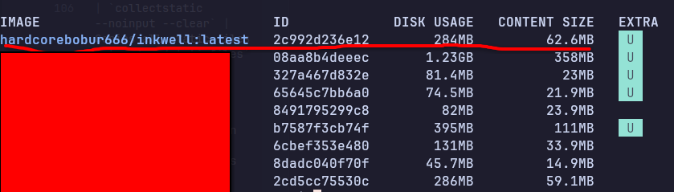

# Dockerfile

The `Dockerfile` builds the production Docker image for the Django app. It uses a **multi-stage build** to keep the final image small and secure.

---

## Why Multi-Stage?

A naive single-stage build would include compilers, build tools, and other heavy packages in the final image — things only needed during installation, not at runtime. Multi-stage builds solve this:

```
Stage 1 (builder)  ──►  installs everything, compiles C extensions
                              │
                              │  copies only /opt/venv
                              ▼
Stage 2 (runtime)  ──►  clean slim image + virtual env = small final image
```

The final image contains no gcc, no build headers — only what's needed to run the app.

---

## Stage 1 — Builder

```dockerfile
FROM python:3.12-slim AS builder

WORKDIR /build

RUN apt-get update \
    && apt-get install -y --no-install-recommends gcc libpq-dev \
    && rm -rf /var/lib/apt/lists/*

RUN python -m venv /opt/venv
ENV PATH="/opt/venv/bin:$PATH"

COPY requirements.txt .
RUN pip install --no-cache-dir --upgrade pip \
    && pip install --no-cache-dir -r requirements.txt
```

| Line | What it does |
|------|-------------|
| `FROM python:3.12-slim AS builder` | Starts from a minimal Python image. `AS builder` names this stage so the next stage can reference it |
| `apt-get install gcc libpq-dev` | Installs C compiler and PostgreSQL headers — required to compile `psycopg2` from source |
| `rm -rf /var/lib/apt/lists/*` | Deletes apt cache immediately to reduce layer size |
| `python -m venv /opt/venv` | Creates an isolated virtual environment at `/opt/venv` |
| `ENV PATH="/opt/venv/bin:$PATH"` | Makes the venv's pip/python the default for subsequent commands |
| `pip install -r requirements.txt` | Installs all dependencies into the venv. `--no-cache-dir` skips pip's download cache to save space |

---

## Stage 2 — Runtime

```dockerfile
FROM python:3.12-slim AS runtime

ENV PYTHONUNBUFFERED=1 \
    PYTHONDONTWRITEBYTECODE=1 \
    PATH="/opt/venv/bin:$PATH"

RUN apt-get update \
    && apt-get install -y --no-install-recommends libpq5 \
    && rm -rf /var/lib/apt/lists/*

RUN groupadd --gid 1001 appgroup \
    && useradd --uid 1001 --gid appgroup --no-create-home --shell /bin/sh appuser

COPY --from=builder /opt/venv /opt/venv

WORKDIR /app
COPY --chown=appuser:appgroup . .

RUN mkdir -p /app/staticfiles \
    && chown appuser:appgroup /app/staticfiles \
    && chmod +x /app/entrypoint.sh

USER appuser

EXPOSE 8000

ENTRYPOINT ["/app/entrypoint.sh"]
CMD ["gunicorn", \
     "--bind", "0.0.0.0:8000", \
     "--workers", "3", \
     "--timeout", "120", \
     "--access-logfile", "-", \
     "--error-logfile", "-", \
     "blog_project.wsgi:application"]
```

| Line | What it does |
|------|-------------|
| `FROM python:3.12-slim AS runtime` | Fresh clean image — no build tools from stage 1 |
| `PYTHONUNBUFFERED=1` | Forces Python stdout/stderr to be unbuffered so logs appear in `docker logs` in real time |
| `PYTHONDONTWRITEBYTECODE=1` | Stops Python from writing `.pyc` cache files — not needed in containers |
| `apt-get install libpq5` | Installs only the PostgreSQL **runtime** library (not headers). Needed by psycopg2 to connect to Postgres |
| `groupadd / useradd` | Creates a non-root user `appuser`. Running as root inside a container is a security risk |
| `COPY --from=builder /opt/venv /opt/venv` | Copies only the finished virtual env from stage 1 — all compiled packages, no build tools |
| `COPY --chown=appuser:appgroup . .` | Copies the application code and sets ownership to `appuser` in one step |
| `chmod +x entrypoint.sh` | Makes the entrypoint script executable |
| `USER appuser` | Switches to the non-root user for all subsequent commands and at runtime |
| `EXPOSE 8000` | Documents that the container listens on port 8000 (informational only, doesn't publish the port) |
| `ENTRYPOINT` | Always runs `entrypoint.sh` first before the main command |
| `CMD ["gunicorn", ...]` | The default command passed to the entrypoint. Starts Gunicorn with 3 workers, logs to stdout |

---

## entrypoint.sh

```sh
#!/bin/sh
set -e

echo "[entrypoint] Applying database migrations..."
python manage.py migrate --noinput

echo "[entrypoint] Collecting static files..."
python manage.py collectstatic --noinput --clear

echo "[entrypoint] Starting server..."
exec "$@"
```

The entrypoint runs every time the container starts, before Gunicorn:

| Command | Why |
|---------|-----|
| `set -e` | Exits immediately if any command fails — prevents Gunicorn starting with a broken DB schema |
| `migrate --noinput` | Applies any pending database migrations automatically on deploy |
| `collectstatic --noinput --clear` | Copies all static files into `/app/staticfiles` so Nginx can serve them |
| `exec "$@"` | Replaces the shell process with Gunicorn (the `CMD`). `exec` ensures Gunicorn gets PID 1 and receives shutdown signals correctly |

---

## Final Image Size Comparison

| Approach | Approx. size |
|----------|-------------|
| Single-stage with build tools | ~800 MB |
| Multi-stage (this Dockerfile) | ~284 MB |

The screenshot below shows the actual `hardcorebobur666/inkwell:latest` image size on Docker Hub after a real build — **284 MB disk usage, 62.6 MB compressed content size**:



The compressed content size (62.6 MB) is what gets transferred over the network when the server pulls the image on deploy. The larger disk usage (284 MB) is the uncompressed size on disk after extraction.
